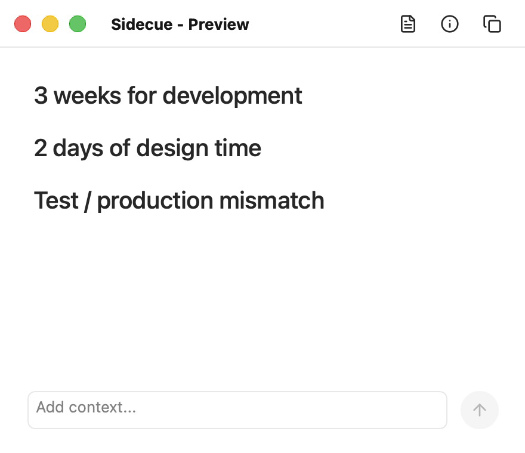

# Sidecue

Quiet cues for live conversations.

A small native macOS window that turns your current input and local reference notes into short speaking cues: facts, numbers, constraints, and points worth mentioning. It helps you find your next point, not generate a scripted answer or send messages on your behalf.



*UI preview with fictional content. This is not a real microphone or model result.*

**Development preview.** The native window, retrieval, Codex adapter, and system speech integration are implemented. Real speech-to-cue latency, recognition reliability, and long-session stability have not completed acceptance testing. There is no standalone installer yet.

## How It Works

```text
Microphone -> macOS Speech --+
                            +-> Local retrieval -> Codex CLI -> Speaking cues
Text input -----------------+
```

- The main window shows concise cues and a text input. Sources and prompt details open from the toolbar; Keep on Top lives in the Window menu.
- Sources are parsed and searched locally. The current input, relevant snippets, and source filenames are sent to Codex for generation.
- Input and generation run independently. One generation runs at a time; only the latest pending input is kept. Previous cues remain visible while an update is pending.
- No Ollama server, local LLM, or separate Whisper model is loaded. "Local Codex" means a locally installed client, not offline inference.
- Results arrive as completed responses, not token-by-token streaming. The window is not a complete transcript or meeting recorder.

## Requirements

- macOS with a framework build of Python 3.12 or later and Xcode Command Line Tools.
- AppKit/PyObjC dependencies listed in `requirements.txt`. The native UI and speech path do not support Windows or Linux.
- For real generation: a compatible Codex CLI, ChatGPT sign-in, network access, and access to the configured model.
- For speech: microphone and speech recognition permissions, a working input device, and on-device recognition support for the configured language.

The local release checks used Python 3.12.12, PyObjC 12.1, and Codex CLI 0.153.4 on macOS 26.5.1. This is a tested environment, not a guarantee for all later versions.

## Quick Start

```sh
git clone https://github.com/cola-runner/sidecue.git
cd sidecue
python3 -m venv .venv
./.venv/bin/python -m pip install -r requirements.txt
```

Ensure `python3` is a framework build. The macOS builder needs its `Resources/Python.app`; installing dependencies cannot add that to a non-framework Python installation.

### Preview Without a Microphone or Model

```sh
./.venv/bin/python -m sidecue --preview-ui
```

This uses fictional sample cues. Submitting text simulates an update; it does not call a model. Adding sources only changes the preview list and does not read the selected files.

### Connect Codex

Install the [Codex CLI](https://learn.chatgpt.com/docs/codex/cli), then sign in using your ChatGPT account:

```sh
codex --version
codex login
codex login status
```

Sidecue finds `codex` on `PATH`, or the bundled CLI in a standard Codex/ChatGPT app installation. Set `llm.codex_command` for a different location.

The CLI must support `exec --ephemeral --ignore-user-config --ignore-rules` and the feature flags used by the adapter. Do not remove isolation flags to work around an incompatible CLI; check the version first.

The configured model is `gpt-5.3-codex-spark`. Availability and quotas depend on your account; access is not guaranteed. See the official [model documentation](https://learn.chatgpt.com/docs/models) and [authentication documentation](https://learn.chatgpt.com/docs/auth).

**No API key is required by this project, but generation is not unlimited or necessarily free.** The adapter requires ChatGPT authentication and removes `OPENAI_API_KEY` and `CODEX_API_KEY` from its child environment. It does not silently switch to API-key billing or another model.

### Try Text Input First

```sh
./scripts/run_macos_app.sh --asr-mode stdin
```

Enter `What are the development, design, and testing constraints?` in the window. Check the cues and their Evidence in Prompt details. This calls the real configured model, but does not open the microphone.

### Use the Microphone

Only start capture when participants have agreed and you are ready to grant access:

```sh
./scripts/run_macos_app.sh
```

Allow Sidecue under System Settings > Privacy & Security > Microphone and Speech Recognition. It uses the system's default input device. The default recognition language is `en-US`; change `asr.language` for another supported language. There is no automatic fallback to online speech recognition.

The launcher builds a local `build/Sidecue.app`. Close the existing app before rebuilding or relaunching. Closing the window or choosing Quit stops input and terminates generation processes owned by Sidecue.

Direct module execution defaults to text input. The macOS launcher defaults to microphone input. With a window, `stdin` means the input field; terminal input is read only when `--no-ui` is set.

## Sources and Configuration

The repository includes only `knowledge/sample_notes.txt`, a fictional example. Use the Sources toolbar button to add TXT, MD, PDF, or DOCX files. Changes to the list last for the current session; removing a source does not delete the original file. Scanned PDFs are not OCR-processed.

Keep private paths and preferences in the ignored `config.local.toml`:

```toml
[documents]
paths = ["./knowledge"]

[asr]
mode = "stdin"
language = "en-US"
on_device = true

[llm]
provider = "codex"
model = "gpt-5.3-codex-spark"
timeout_seconds = 30.0
```

Load it explicitly; it is not discovered automatically:

```sh
./.venv/bin/python -m sidecue --config config.local.toml
./scripts/run_macos_app.sh --config "$PWD/config.local.toml" --asr-mode stdin
```

Missing fields use built-in defaults, not a second merge with the repository's `config.toml`. Relative source paths resolve against the selected configuration file. Pass an absolute external configuration path to the app launcher.

| Setting | Behavior |
| --- | --- |
| `retrieval.top_k` | At most 3 relevant chunks by default, rather than entire files |
| `asr.language` | Recognition locale; for example `en-US` or `zh-CN` |
| `asr.on_device` | `true` by default; explicitly disabling it changes the speech privacy boundary |
| `llm.system_prompt` | Cue content and formatting; the default output is English |
| `llm.timeout_seconds` | Generation timeout, not an end-to-end latency promise |
| `llm.provider` | `codex` by default; `mock` is synthetic; `apple_fm` is experimental and unverified |

Private files inside `knowledge/` are ignored by Git and excluded from the app bundle. To load them in the app, add them through Sources or select an external configuration.

## Troubleshooting

| Symptom | Check |
| --- | --- |
| `Python.app not found` | Use a framework Python build to create the virtual environment |
| Already running or being built | Close the existing window before relaunching |
| Audio arrives, but no words | Speech permission, on-device language support, input device, and volume |
| Words arrive, but no cues | Prompt details, Codex sign-in, model access, quota, network, and timeout |
| Cues do not match the sources | Source list and retrieved snippets in the Context tab |

Test recognition without calling a model:

```sh
./scripts/check_mic.sh --check-seconds 15
```

Only a nonempty transcript produces `MIC_CHECK PASS`. Audio levels and a running engine alone do not count. Successful checks print character counts, not the transcript. Permission waiting and listening have separate time limits.

See [validation status](docs/recovery.md) for remaining real-device and model checks. A working preview is not proof that the complete speech-to-cue path works.

## Privacy

Codex receives current input, relevant source snippets, and filenames. Local retrieval does not make generation offline. Obtain permission to capture conversations and send this material to your selected service.

Normal application logs record status, lengths, timing, and error categories. Console output, copied details, screenshots, and `--show-prompt` can contain private content. Review diagnostics before sharing them.

Native logs live at `~/Library/Logs/Sidecue/app.log`. Old logs are not deleted automatically. Do not publish logs, recordings, account files, personal configuration, or actual meeting notes.

**Do not upload `build/Sidecue.app` as a release installer.** It depends on the build machine's Python framework and contains machine-specific runtime paths. Source publication and local development builds are the supported distribution paths for now.

See [PRIVACY.md](PRIVACY.md) and [SECURITY.md](SECURITY.md).

## Development

```sh
./.venv/bin/python -m unittest discover -s tests -v
RUN_GUI_TESTS=1 ./.venv/bin/python -m unittest discover -s tests -v
# Close the app first. Rebuilds and repeatedly launches the actual .app.
RUN_GUI_TESTS=1 RUN_BUNDLE_TESTS=1 ./.venv/bin/python -m unittest discover -s tests -v
./.venv/bin/python scripts/check_public_tree.py --history
git diff --check
```

These tests use mocks and fictional inputs. They do not request microphone access or call real models. The bundle tests cover the native launcher's shutdown, including the autorelease-pool ordering regression that could produce an unexpected-quit alert after closing the window.

Regenerate the README image from the actual native controls and fictional fixtures with `./.venv/bin/python scripts/capture_ui_preview.py`. This renders only the preview window, not the desktop.

The publication checker examines candidate files and locally reachable history. It does not prove the absence of secrets; images, attachments, author metadata, and remote-only objects also need review. See [CONTRIBUTING.md](CONTRIBUTING.md).

Maintained by Ezreal.

## License

Sidecue is licensed under the [MIT License](LICENSE). Copyright (c) 2026 Ezreal.

Icons are from [Lucide](https://lucide.dev/) under the included [ISC license](sidecue/assets/LUCIDE-LICENSE). Third-party dependencies retain their own licenses.
